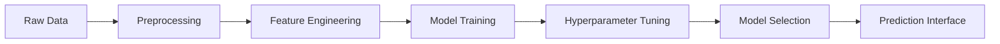

# 🎬 Movie Rating Prediction System

<div align="center">


*A sophisticated machine learning system that predicts movie ratings with high accuracy using advanced feature engineering and ensemble methods.*

[🚀 Quick Start](#-quick-start) • [📊 Features](#-features) • [🛠️ Installation](#️-installation) • [📈 Usage](#-usage) • [🔧 How It Works](#-how-it-works)

</div>

---

## 🌟 Overview

This intelligent movie rating prediction system leverages multiple machine learning algorithms to predict movie ratings on a 1-10 scale. By analyzing features like genre, director credentials, cast performance, and release metadata, it provides accurate rating predictions with comprehensive visualization and analysis tools.

### ✨ Key Highlights

- 🎯 **High Accuracy**: Uses ensemble methods including Random Forest and Gradient Boosting
- 🔧 **Smart Feature Engineering**: Creates meaningful features from raw movie metadata
- 🖥️ **Dual Interface**: Both GUI and command-line interfaces available
- 📊 **Rich Visualizations**: Comprehensive charts and performance metrics
- 💾 **Model Persistence**: Save and load trained models for future use

---

## 📊 Features

### 🔍 **Data Processing & Engineering**
- **Missing Value Handling**: Intelligent imputation strategies
- **Feature Extraction**: Director/actor success metrics, genre popularity
- **Data Transformation**: Categorical encoding, numerical scaling
- **Temporal Features**: Decade-based analysis and trends

### 🤖 **Machine Learning Models**
| Model | Purpose | Key Benefits |
|-------|---------|--------------|
| **Random Forest** | Ensemble prediction | High accuracy, feature importance |
| **Gradient Boosting** | Sequential improvement | Handles complex patterns |
| **Linear Regression** | Baseline comparison | Interpretable coefficients |

### 🎨 **Visualization Suite**
- 📈 Feature importance rankings
- 🎯 Actual vs. predicted scatter plots
- 📊 Error distribution analysis
- 🔍 Model performance metrics

### 🖥️ **User Interfaces**
- **🖼️ Graphical Interface**: User-friendly GUI with form inputs
- **💻 Command Line**: Programmatic access for batch processing
- **📱 Interactive**: Real-time predictions with immediate feedback

---

## 🛠️ Installation

### Prerequisites
- Python 3.8 or higher
- pip package manager

### Quick Install
```bash
# Clone the repository
git clone https://github.com/yourusername/movie-rating-prediction.git
cd movie-rating-prediction

# Install dependencies
pip install pandas numpy matplotlib seaborn scikit-learn

# Verify tkinter (usually pre-installed)
python -c "import tkinter; print('✅ GUI support available')"
```

### Dependencies
```
pandas>=1.3.0
numpy>=1.21.0
matplotlib>=3.4.0
seaborn>=0.11.0
scikit-learn>=1.0.0
tkinter (included with Python)
```

---

## 🚀 Quick Start

### 🖥️ Launch the Application
```bash
python movie_rating_predictor.py
```

### 📊 Expected Data Format
Your CSV file should contain these columns:

| Column | Description | Example |
|--------|-------------|---------|
| `Name` | Movie title | "The Dark Knight" |
| `Year` | Release year | 2008 |
| `Duration` | Runtime (minutes) | 152 |
| `Genre` | Genres (comma-separated) | "Action, Crime, Drama" |
| `Rating` | Target rating | 9.0 |
| `Votes` | Number of ratings | 2500000 |
| `Director` | Director name | "Christopher Nolan" |
| `Actor 1-3` | Lead actors | "Christian Bale" |

> 💡 **No data?** The system automatically generates sample data for testing!

---

## 📈 Usage

### 🖼️ GUI Interface

<div align="center">

```
┌─────────────────────────────────────┐
│         Movie Rating Predictor      │
├─────────────────────────────────────┤
│ Movie Name: [________________]      │
│ Year:       [____] Duration: [___]  │
│ Genre:      [________________]      │
│ Director:   [________________]      │
│ Actor 1:    [________________]      │
│                                     │
│  [Predict Rating] [Reset] [Sample]  │
│                                     │
│ Predicted Rating: ⭐ 8.2/10         │
└─────────────────────────────────────┘
```

</div>

**Steps:**
1. 📝 Fill in movie details
2. 🎯 Click "Predict Rating"
3. 📊 View prediction with confidence metrics
4. 🔄 Use "Reset" to clear or "Load Sample" for examples

### 💻 Console Interface
```bash
$ python movie_rating_predictor.py --console
Enter movie name: Inception
Enter year: 2010
Enter duration: 148
...
🎬 Predicted Rating: 8.7/10 (High Confidence)
```

---

## 🔧 How It Works

### 🔄 **Pipeline Overview**



### 1️⃣ **Data Preprocessing**
- 🧹 Clean missing values with domain-specific strategies
- 🔄 Convert data types for optimal processing
- 📊 Handle categorical variables with encoding

### 2️⃣ **Feature Engineering**
```python
# Example engineered features
✨ Primary Genre Extraction
📅 Decade-based Trends  
🎭 Director Success Score
⭐ Actor Popularity Index
⏱️ Duration Categories
📊 Vote Count Transformation
```

### 3️⃣ **Model Training & Selection**
- 🎯 **Cross-validation**: 5-fold validation for robust performance
- 🔍 **Grid Search**: Automated hyperparameter optimization  
- 📊 **Evaluation Metrics**: RMSE, MAE, R² for comprehensive assessment
- 🏆 **Model Selection**: Best performer automatically selected

### 4️⃣ **Performance Metrics**
| Metric | Description | Typical Value |
|--------|-------------|---------------|
| **RMSE** | Root Mean Square Error | < 0.8 |
| **MAE** | Mean Absolute Error | < 0.6 |
| **R²** | Coefficient of Determination | > 0.75 |

---

## 📁 Project Structure

```
movie-rating-prediction/
├── 📄 movie_rating_predictor.py    # Main application
├── 💾 movie_rating_model.pkl       # Trained model (auto-generated)
├── 📊 visualizations/
│   ├── feature_importance.png      # Feature analysis
│   ├── actual_vs_predicted.png     # Performance visualization
│   ├── error_distribution.png      # Error analysis
│   └── error_vs_predicted.png      # Prediction quality
├── 📋 requirements.txt             # Dependencies
└── 📖 README.md                    # This file
```

---

## 🔬 Advanced Usage

### 🆕 Adding Custom Features
```python
def engineer_features(df):
    # Add your custom features here
    df['custom_feature'] = your_transformation(df)
    return df
```

### 🎯 Training on New Data
1. Prepare CSV with required columns
2. Adjust preprocessing if needed
3. Run training pipeline
4. Evaluate model performance

### 🔧 Hyperparameter Tuning
```python
# Customize grid search parameters
param_grid = {
    'random_forest__n_estimators': [100, 200, 300],
    'random_forest__max_depth': [10, 20, None]
}
```

---

## 🎨 Visualizations

<div align="center">

| Feature Importance | Model Performance | Error Analysis |
|:-----------------:|:----------------:|:-------------:|
|  |  |  |

</div>

---

## 🚨 Troubleshooting

### Common Issues & Solutions

| Issue | Solution |
|-------|----------|
| 🚫 **Missing Data Errors** | Ensure CSV has all required columns |
| 🖥️ **GUI Not Loading** | Verify tkinter installation: `python -m tkinter` |
| 📉 **Poor Predictions** | Increase training data size or adjust features |
| 💾 **Model Loading Fails** | Delete `.pkl` file to retrain model |

### Getting Help
- 📚 Check the [documentation](#)
- 🐛 Report bugs in [Issues](../../issues)
- 💬 Ask questions in [Discussions](../../discussions)

---

## 🤝 Contributing

We welcome contributions! Here's how you can help:

1. 🍴 Fork the repository
2. 🌿 Create a feature branch (`git checkout -b feature/amazing-feature`)
3. 💾 Commit changes (`git commit -m 'Add amazing feature'`)
4. 🚀 Push to branch (`git push origin feature/amazing-feature`)
5. 📝 Open a Pull Request

### Development Setup
```bash
# Install development dependencies
pip install -r requirements-dev.txt

# Run tests
python -m pytest tests/

# Format code
black movie_rating_predictor.py
```

---

## 📄 License

This project is licensed under the MIT License - see the [LICENSE](LICENSE) file for details.

```
MIT License - Feel free to use, modify, and distribute!
```

---

## 🙏 Acknowledgments

- 🔬 **scikit-learn**: Powerful machine learning library
- 🖥️ **tkinter**: GUI framework for Python
- 📊 **pandas & numpy**: Data manipulation and analysis
- 🎨 **matplotlib & seaborn**: Beautiful visualizations

---

<div align="center">

### ⭐ Star this repo if you found it helpful!


**Made with ❤️ for the machine learning community**

[🔝 Back to Top](#-movie-rating-prediction-system)

</div>
